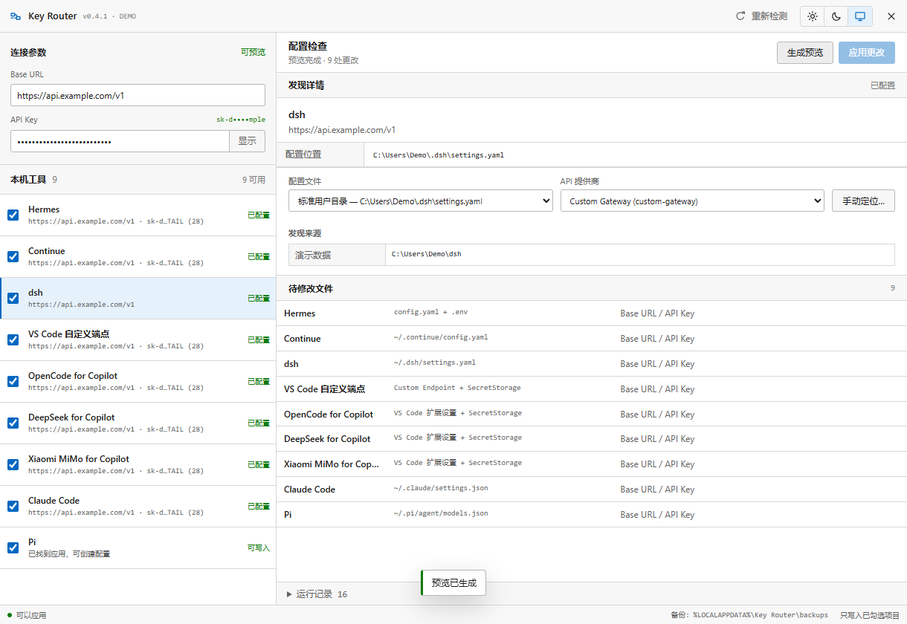

# Key Router

把一组 **Base URL + API Key** 批量写入多个本地 AI 工具。先自动发现，再预览、备份和应用。



## 支持的工具

| 工具 | 写入位置 |
|---|---|
| Hermes | `.env` 与 `config.yaml` |
| Continue | `~/.continue/config.yaml` |
| dsh | `~/.dsh/settings.yaml` 与 `.credentials.yaml` |
| VS Code | Custom Endpoint 与 SecretStorage |
| OpenCode for Copilot | `opencodego.apiBaseUrl` 与 SecretStorage |
| DeepSeek for Copilot | `deepseek-copilot.baseUrl` 与 SecretStorage |
| Xiaomi MiMo for Copilot | `mimo-copilot.baseUrl` 与 SecretStorage |
| Claude Code | `~/.claude/settings.json` |
| Pi | `~/.pi/agent/models.json` |

## 使用

直接运行 `Key-Router.exe`，然后：

1. 填写 Base URL 和 API Key；
2. 检查自动发现的路径；dsh 可选择配置文件和提供商；
3. 勾选目标工具并生成预览；
4. 确认后批量应用。

VS Code 被选中时，请先完全退出 VS Code。界面支持日间、夜间和跟随系统主题。

缺少受支持的 VS Code 扩展时，界面会显示扩展名称、发布者和完整 ID。只有用户在确认窗口中同意后，软件才调用本机 VS Code 安装该扩展。

## 自动发现

- Hermes：读取 `HERMES_HOME` 或官方默认的 `~/.hermes`，并通过 PATH 与开始菜单确认程序；
- dsh：优先读取 `DSH_HOME` 和 `~/.dsh/settings.yaml`，再通过 PATH、注册表和开始菜单快捷方式确认程序位置；
- VS Code：通过 PATH、App Paths、常用目录和开始菜单快捷方式定位，即使程序装在 D 盘或 E 盘也可识别；
- VS Code 扩展：读取用户扩展目录、`VSCODE_EXTENSIONS` 和快捷方式中的 `--extensions-dir`，同时忽略 `.obsolete` 中已卸载的残留目录；
- Claude Code：读取 `CLAUDE_CONFIG_DIR` 或官方默认的 `~/.claude`；Pi 使用 `~/.pi/agent`；
- 自动发现只检查明确线索，不默认递归扫描整个磁盘；找不到 dsh 配置时可由用户手动选择 `settings.yaml`。

## 安全设计

- 默认只预览，不直接写入；
- 每次应用前自动备份；VS Code 的 WAL 数据库使用一致性快照；
- 写入失败自动恢复；
- 页面和日志不显示完整 Key；
- 只监听 `127.0.0.1`，校验 Host / Origin，并使用会话令牌与一次性预览令牌；
- VS Code 的 API Key 写入 Windows 加密的 SecretStorage。
- 扩展安装接口只接受内置白名单 ID，不能执行任意命令。

## 从源码运行

```powershell
pip install -r requirements.txt
python web_app.py
```

脱敏演示模式：

```powershell
python web_app.py --demo
```

## 命令行

```powershell
python rotate_keys.py --detect
python rotate_keys.py --url https://api.example.com/v1 --key YOUR_KEY --targets hermes,claude,pi
python rotate_keys.py --url https://api.example.com/v1 --key YOUR_KEY --targets hermes,claude,pi --apply
```

## 测试与打包

```powershell
python -m unittest discover -s tests -v
python web_app.py --smoke-test
node --check ui\app.js
pip install -r requirements-build.txt
pyinstaller key-rotator.spec --clean
```

打包后还可运行隔离写入验收：

```powershell
python tests\package_e2e.py dist\Key-Router.exe
```

单文件产物：`dist/Key-Router.exe`。

## 兼容性

- Windows 10 / 11；
- Python 3.10+（仅源码运行需要）；
- 同一 Base URL 仍需与目标工具使用的 OpenAI / Anthropic 协议兼容；Key Router 不会转换 API 协议；
- macOS 与 Linux 暂不支持。

## License

MIT
